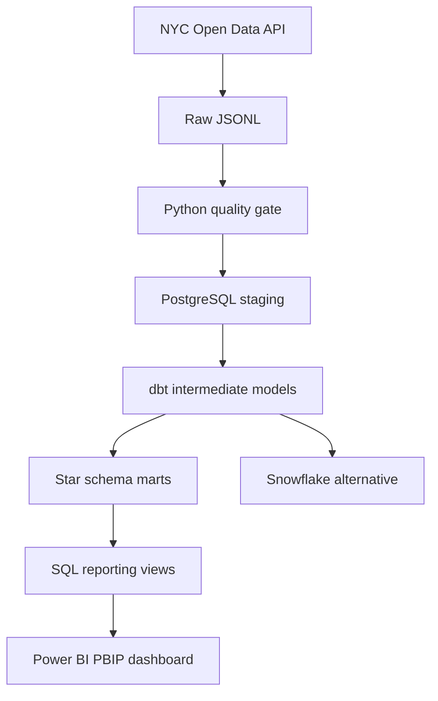
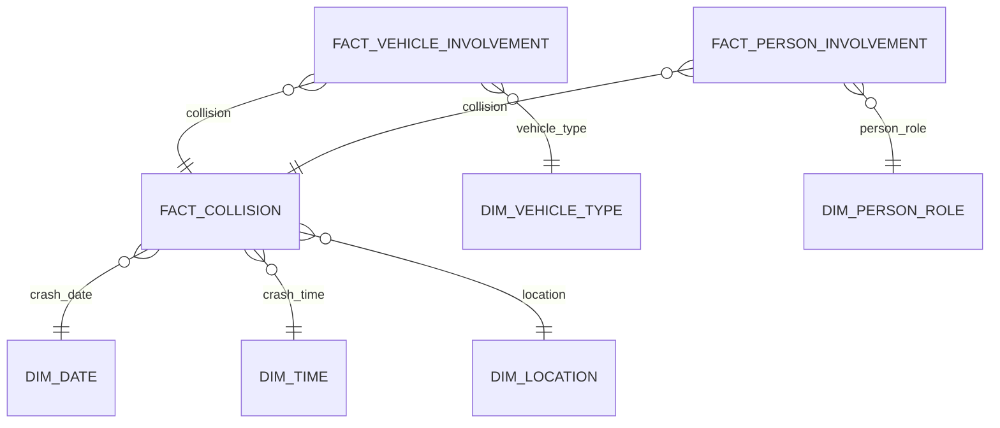

# Motor Claims Analytics Warehouse

A portfolio-grade data warehouse built from the official NYC Motor Vehicle Collisions datasets. The project demonstrates dimensional modelling, repeatable ETL, data quality, dbt transformations, and the practical trade-offs between star and snowflake schemas.

> The source contains public collision records, not insurance-policy or customer data. “Claims” metrics are analytical risk proxies and must not be interpreted as actual insurer loss amounts.

## Business goal

Give road-safety and motor-insurance analysts a consistent model for answering:

- When and where do severe collisions occur?
- Which vehicle types and contributing factors are associated with higher severity?
- How many vehicles and people are involved in each collision?
- How do collision, injury, and fatality trends change over time?
- Which data-quality issues could distort those conclusions?
- Which explainable anomaly signals should be prioritized for analyst review?
- Which vehicle types and locations are high-volume versus high-severity?

## Sources

| Dataset | NYC Open Data ID | Grain |
|---|---|---|
| Crashes | `h9gi-nx95` | One row per collision |
| Vehicles | `bm4k-52h4` | One row per vehicle involved |
| Persons | `f55k-p6yu` | One row per person involved |

The ingestion command uses the official Socrata API and supports incremental date filters and configurable limits.

## Architecture



## Dimensional model

The primary production design is a star schema because it keeps BI queries simple and fast.



Detailed grain decisions and the snowflake comparison are in [docs/dimensional_model.md](docs/dimensional_model.md).

## Quick start

Requires Python 3.11+. The lightweight sample pipeline uses only the standard library.

```bash
python -m src.motor_dwh.cli validate-sample
python -m unittest discover -s tests -v
```

Download a bounded slice from the public API:

```bash
python -m src.motor_dwh.cli extract \
  --dataset crashes \
  --limit 10000 \
  --since 2025-01-01 \
  --output data/raw/crashes.jsonl
```

Start PostgreSQL:

```bash
docker compose up -d postgres
```

Run dbt after installing `dbt-postgres` and configuring the included profile example:

```bash
dbt seed
dbt run
dbt test
dbt docs generate
```

## Layers

| Layer | Purpose |
|---|---|
| `raw` | Immutable API payloads with ingestion metadata |
| `staging` | Renamed, typed, and minimally cleaned source records |
| `intermediate` | Reusable joins and derived severity rules |
| `marts` | Star schema facts and dimensions for analytics |
| `snowflake` | Normalized location hierarchy for comparison |
| `reporting` | Power BI-ready views, KPI contracts, and explainable risk proxies |

## SQL analytics

The numbered files in [`sql/`](sql/) form an auditable analysis path:

1. data quality and reconciliation;
2. executive KPIs and year-over-year comparison;
3. severity percentiles, vehicle ranking, and risk quartiles;
4. explainable anomaly-signal proxies;
5. hotspot ranking and rolling 30-day trends;
6. the Power BI serving contract.

The analysis demonstrates CTEs, conditional aggregation, `FILTER`, `LAG`,
rolling windows, `PERCENTILE_CONT`, `DENSE_RANK`, and `NTILE`.

## Power BI dashboard

The source-controlled PBIP project is available at
[`powerbi/MotorClaimsIntelligence.pbip`](powerbi/MotorClaimsIntelligence.pbip).
It contains six interactive pages and 41 native visuals:

- Executive Overview
- Severity & Risk
- Anomaly Signal Explorer
- Vehicle Risk Profile
- Geographic Hotspots
- Collision Detail

See [the dashboard guide](docs/powerbi_dashboard.md) and
[DAX catalogue](powerbi_measures.md).

## Repository map

```text
src/motor_dwh/       Extraction and quality logic
data/sample/         Small deterministic fixtures
models/              dbt staging, intermediate, and marts
models/reporting/    Power BI-ready dbt views
sql/                 Numbered SQL analyses and BI contract
powerbi/             PBIP report and TMDL semantic model
docs/                Requirements, grain, and modelling decisions
tests/               Unit tests
```

## Quality controls

- required collision identifiers;
- valid latitude and longitude ranges;
- non-negative injury and fatality counts;
- collision totals reconciled with person-level fields;
- duplicate natural-key detection;
- accepted-values and relationship tests in dbt;
- source freshness metadata through `ingested_at`.

## Portfolio skills demonstrated

Dimensional modelling, fact grain selection, conformed dimensions, surrogate
keys, star vs snowflake trade-offs, incremental ingestion, idempotency, data
contracts, data-quality tests, advanced PostgreSQL analytics, window functions,
dbt reporting views, DAX, PBIP/PBIR/TMDL, Power BI interaction design, Docker,
and CI.

## License

MIT. Dataset terms remain governed by NYC Open Data.
